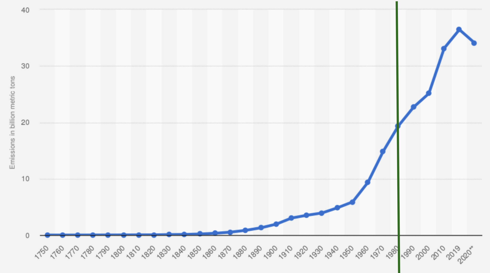
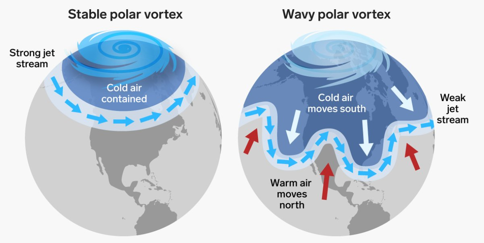
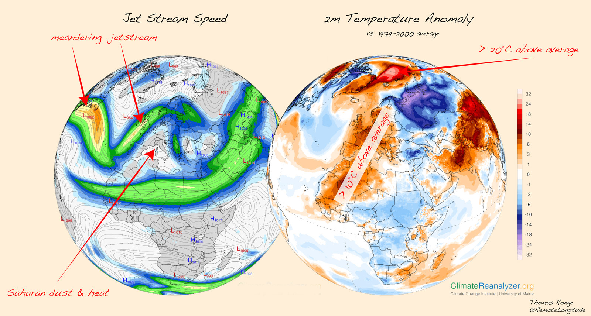
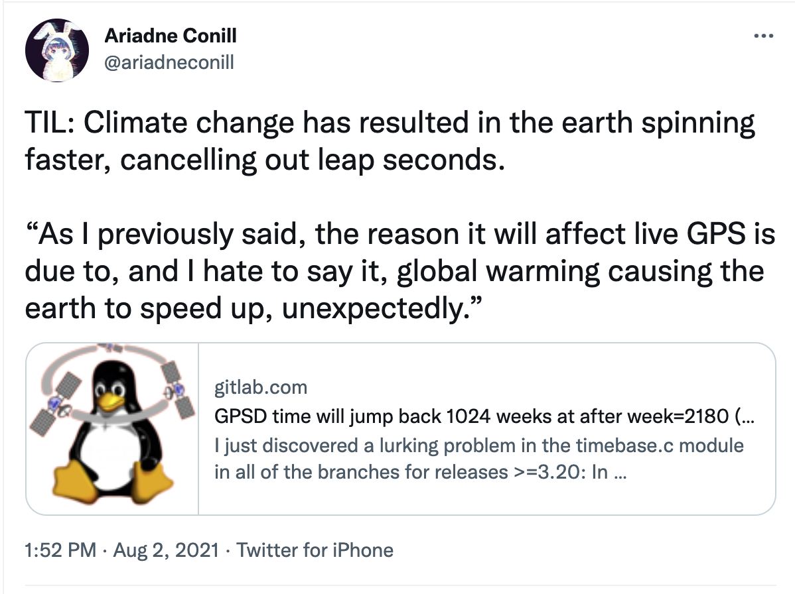
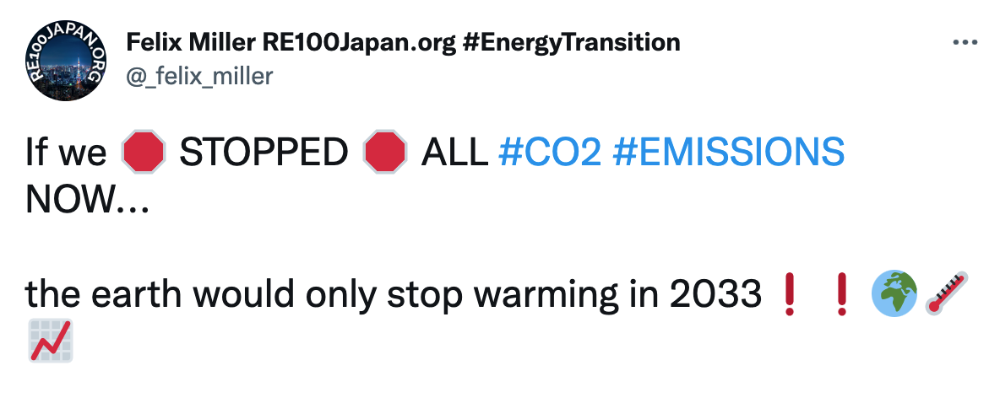
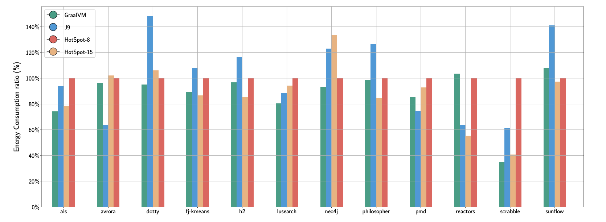
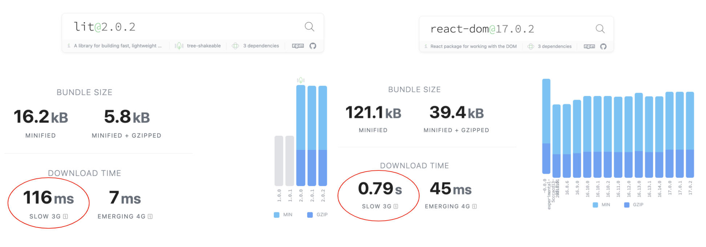
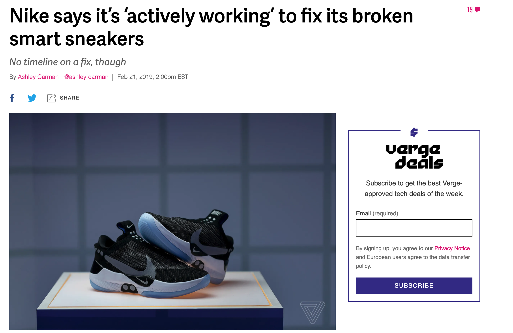

footer: @jlengrand
slidenumbers: true

# What can I do about climate change as a developer... and a human being? 

--- 

# 👋👋

 

- Julien
- Developer Advocate **@Adyen**
- Java Magazine
- **@jlengrand**

 

- #Meetups #Kotlin #Gardening 

---

^ Today, as a dad. The current trend of climate change is not looking great
^ Tough talk but let's make it hopeful and positive. 
^ We'll be looking at the developer side of things. Wat we can do. But mostly, what we can do as humans
^ maybe obvious, im sorry. No blaming, I promise

* ⚠️ I'm not a climate scientist :)
* 👏 let's do it positively
* 👉 No pointing fingers

---

# Let's look into the situation before diving further

---

^ We humans are creating many problems (biodiversity, soil pollution, ...) but the main one is CO2 emissions because it has a massive impact on climate.

* **48%** of world total global emissions since I was born

---

^ https://twitter.com/remotelongitude/status/1363084317874925569
^ https://twitter.com/unfccc/status/1361355803949756416
^ - The problem is not _actually_ those 2 degrees

Global "warming" is a bad term.

---

---

> Climate change is watching disasters happen on other people's cameras, until you are the one filming the disaster

-- Unknown Twitter user

---

^ https://twitter.com/i/web/status/1422163289518313474

With crazy effects

---

^ with latency : https://twitter.com/i/web/status/1283734207760670721

And a lot of latency

---

# So let's get to it

---
 
## **Reduce**
## Reuse
## Recycle

---

<!-- ^ https://www.youtube.com/watch?v=GhfpyT-b-bA

Backend, reactive

???? Need to say more
Use latest version. Java power consumption
frameworks

--- -->

^ https://hal.inria.fr/hal-03275286/document

The version of your tools matter

---

^ https://bundlephobia.com/

And maybe you don't need a framework

[^1]: Source [bundlephobia](https://bundlephobia.com/)

---

^ https://memoakten.medium.com/the-unreasonable-ecological-cost-of-cryptoart-2221d3eb2053

Choice of technology matters

---

^ https://www.theverge.com/circuitbreaker/2019/2/21/18234615/nike-adapt-bb-fix-android-bug-firmware-update-patch

> Your scientists were so preoccupied with whether or not they could, they didn’t stop to think if they should.
-- Dr Ian Malcolm, Jurassic Park

<!-- Best feature is the one that doesn't exist. Do we _really_ need this? -->
<!-- Do we need self warming mugs, with updates? 9999999? -->

---

# 99.99999%

---

80% of the cost is in the production of devices. Let's make sure NOT to need to change devices.

---

phone change, 10 years battery

---

https://principles.green/

---

# But wait a second. . . 

---

How many of you have a < 400$ phone? How many of you have a > 2000$ laptop? 

---

Remember this guy ? M1 Pro

---

Let's dive into CO2 consumption of the typical European

Only a 1/3 is Tech

---

To wish the change, you have to _be_ the change. 

---

Conferences. Need to go to Java One ? That's your whole year of meat

---

reminder, 2 Tons.

---

We need to act now, on all fronts

---

Situation C02 Netherlands

---

C02 comsumption before and now

---

if you are not the change, who is money

---

no guilt shaming, we are not perfect. No zealots

---

We are just 1%. Yes, but.

---

Check your facts
Netflix thing

one is certain -> 99% concensus

https://www.carbonbrief.org/factcheck-what-is-the-carbon-footprint-of-streaming-video-on-netflix
---

It's the corporations. True. But we have 2 choices: 

* Reduce consumption
* Vote! 
* Don't work there.

---

Life is fun out of tech! 

Garden. 70% of my food.

---

Best time to be alive. Don't lose hope 
No dooming

---

It's really not too late, at your level.

---

REDUCE 
REUSE 
RECYCLE

---

What to do tomorrow : 

* Yourself first, others second
* Reduce, reduce, reduce, 
* Spread the word

---

Le problème en ce bas monde est que les imbéciles sont sûrs d’eux et fiers comme des coqs de basse cour, alors que les gens intelligents sont emplis de doute.

---

We are all well aware of it : the current trend of climate change is not looking great. We can already feel some of its consequences and it is very likely to only become worse.
Tech is driving the world though, and us developers can surely help make an impact to bend the curve. So let's dive into the topic together and see how we can debug it!

In this talk, we will look into the current situation, globally but also in the tech space. We will dive into the impact that we can make on our applications as developers.
We will start by talking about our technical stack and what we can do to improve it, from reactive architectures to web performance. We will run the numbers and see the kind of improvements we can reach there.
But we will also look into the larger perspective of things, and look closer at our own personal footprint.

The future may look uncertain, but we can all start making a difference today and look at things in a positive way. So let's debug!

At the end of this talk, attendees will :

* Know more about the impact of IT on climate change, in a factual way
* Learn about specific technologies and tools that can make an impact on their applications in terms of energy consumption
* Have clear and specific action items to reduce their footprint, and further

---

???? https://github.com/cnumr/GreenIT-Analysis

---

https://www.carbonbrief.org/factcheck-what-is-the-carbon-footprint-of-streaming-video-on-netflix

