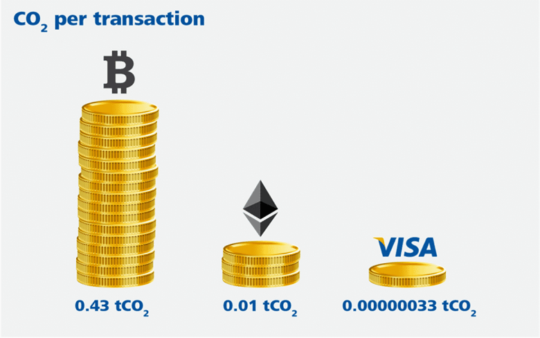

footer: @jlengrand
slidenumbers: true

# What can I do about climate change as a developer... and a human being? 

--- 

# 👋👋

 

- Julien
- Developer Advocate **@Adyen**
- Kotlin GDE
- **@jlengrand**

 

- #Meetups #Kotlin #Gardening 

---

^ Today, as a dad. The current trend of climate change is not looking great
^ Tough talk but let's make it hopeful and positive. 
^ We'll be looking at the developer side of things. Wat we can do. But mostly, what we can do as humans
^ maybe obvious, im sorry. No blaming, I promise

* ⚠️ I'm not a climate scientist :)
* 👏 let's do it positively
* 👉 No pointing fingers

---

> Content

- Current situation
- Tackling it with Tech
- A personal take
- Final tips! 

---

# Let's look into the situation before diving further

---

^ We humans are creating many problems (biodiversity, soil pollution, ...) but the main one is CO2 emissions because it has a massive impact on climate.

 **48%** of world total global emissions since I was born

---

^ https://twitter.com/remotelongitude/status/1363084317874925569
^ https://twitter.com/unfccc/status/1361355803949756416
^ - The problem is not _actually_ those 2 degrees

Global "warming" is a bad term.

---

---

> Climate change is watching disasters happen on other people's cameras, until you are the one filming the disaster

-- Unknown Twitter user

---

^ https://twitter.com/i/web/status/1422163289518313474

With crazy effects

---

^ with latency : https://twitter.com/i/web/status/1283734207760670721

And a lot of latency

---

# So let's get to it

---
 
## **Reduce**
## Reuse
## Recycle

---

Do you really need 

> **99.99999%**

<!-- --- -->

<!-- ^ https://www.youtube.com/watch?v=GhfpyT-b-bA

Backend, reactive

???? Need to say more
Use latest version. Java power consumption
frameworks

--- -->

<!-- ^ https://hal.inria.fr/hal-03275286/document

The version of your tools matter -->

---

^ https://bundlephobia.com/

Also, maybe you don't need a framework

[^1]: Source [bundlephobia](https://bundlephobia.com/)

---

^ https://memoakten.medium.com/the-unreasonable-ecological-cost-of-cryptoart-2221d3eb2053

Choice of technology matters

---

^ https://www.theverge.com/circuitbreaker/2019/2/21/18234615/nike-adapt-bb-fix-android-bug-firmware-update-patch

> Your scientists were so preoccupied with whether or not they could, they didn’t stop to think if they should.
-- Dr Ian Malcolm, Jurassic Park

---

^ https://httparchive.org/reports/page-weight

Average web page size raised by **1240%** in 10 years

<!-- --- -->

<!-- - average mobile phone : **55 kg** of carbon emissions
- **1.55 billion** phones are sold per year 

- EU 2019 : **14.2 million tonnes** of CO2 -->

---

^ https://www.coolblue.nl/en/advice/lifespan-smartphone.html#:~:text=The%20Consumentenbond%20estimates%20the%20average,last%2015%20to%2018%20months.

In the Netherlands, **the average lifespan of a phone 2.5 years**. 

<!-- Other sources indicate that a new smartphone will last **15 to 18 months**. -->

---

^ 80% of the cost is in the production of devices. Let's make sure NOT to need to change devices.
^ https://mossy.earth/guides/lifestyle/sustainable-and-ethical-smartphones

Your users' smartphone

---

^ https://www.theguardian.com/commentisfree/2021/sep/18/want-to-save-the-earth-then-dont-buy-that-shiny-new-iphone

**Buying** one new phone takes as much energy as recharging and operating a smartphone **for an entire decade**

---

# But wait a second. . . 

---

^ How many of you have a < 400$ phone? How many of you have a > 2000$ laptop? 

How many of you . . . ?

---
<!-- 

--- -->

>  If you're asking your kids to exercise, then you better do it, too. Practice what you preach.

<!-- > *Caitlyn Jenner* -->

---

# A dive into my carbon footprint

---

<!-- # CO2 emissions in a nutshell 

- Global average :  Tons / person / year
- Average Netherlands : 8.42 Tons / person / year
- **Target : 3 Tons / person / year**

--- -->

^ https://apps.apple.com/us/app/earth-hero-climate-change/id1458057746

# My footprint in 2018

* Me : **17.4 Tons / year**
* NL : 10.8 Tons / year
* Global : 5.1 Tons / year
* **Goal : 3 Tons / year**

---

* Tech represents **only 1/5** of my emissions
* Over half is me travelling
* A trip to San Fransisco = roughly **2 Tons** of CO2

---

Let's prioritize

---

---

We are not **perfect**. We get better every day

---

But we do need to be passionate

---

And bring the next generation with us

---

We can compensate for what we can't reduce.

---

# Some additional thoughts

---

^ https://wid.world/simulator/
^ https://www.theguardian.com/environment/2020/sep/21/worlds-richest-1-cause-double-co2-emissions-of-poorest-50-says-oxfam

> Globally, the **richest 10%** are those with incomes **above $35,000** a year...

If we are not the change, who is ?

---

> **The richest 10%** of the global population, are responsible for about **52% of global emissions ...**

"We are just 1% of emissions".

---

^ https://twitter.com/dorrismccomics/status/1455532264960499715

---

**"It's the big corporations". True but**

- We buy their products
- We work there
- We vote 

---

And many are committing

---

# Final tips! 

---

^ https://www.carbonbrief.org/factcheck-what-is-the-carbon-footprint-of-streaming-video-on-netflix

Check your facts

---

^ https://principles.green/

[Principles of Green Software Engineering](https://principles.green/)

---

Prioritize

---

<!-- 

--- -->

> No dooming

Best time to be alive. Don't lose hope

---

It's **really** not too late, but we need to act now.

---

## **Reduce**
## Reuse
## Recycle

---

# Sources : 

* https://github.com/jlengrand/climate-change-quickie/